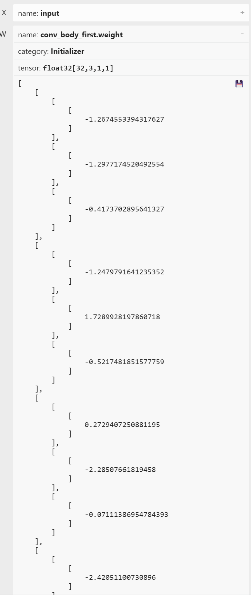
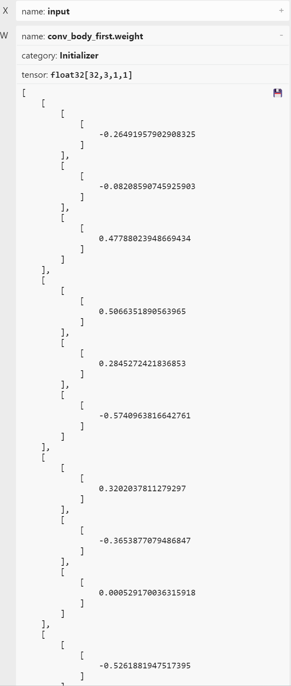

# 基于Libtorch的GFPGAN推理Debug

C++版本的PyTorch，也可以用来部署模型。Tips: ***改一个地方后，一定要记得跑一遍推理***。

## 前置条件

Libtorch加载基于torch.jit.ScriptModule导出的文件，可以是模型、文件等。
在尝试torch.jit.script导出前，务必认真学习官方文档，来源于[TORCHSCRIPT LANGUAGE REFERENCE](https://pytorch.org/docs/stable/jit_language_reference.html#language-reference)。从本质出发可以预测问题，从错误出发查找原因只会事倍功半。

## 使用C++推理

不同框架下推理过程大同小异，libtorch推理过程如下：
1. 申请内存空间，用以存储[[R],[G],[B]]格式的数据。
2. 创建推理使用的```torch::Tensor```， 数据指针指向步骤1申请的内存。
3. ```forward()```
4. 取推理结果。

***注意***：如果模型IO类型非float32，则应该在输入输出Tensor中显式的指明数据类型。

c++代码：
```c++
float* datas = new float[3 * 512 * 512];
cv::imshow("Old img", resize_img);

//pre-process
resize_img.convertTo(temp_input_data, CV_32FC3, 1.0 / 255.0);
temp_input_data = (temp_input_data - 0.5) / 0.5;

cv::split(temp_input_data, split_res);

memcpy(datas + 0 * 512 * 512, split_res[2].data, sizeof(float) * 512 * 512);
memcpy(datas + 1 * 512 * 512, split_res[1].data, sizeof(float) * 512 * 512);
memcpy(datas + 2 * 512 * 512, split_res[0].data, sizeof(float) * 512 * 512);
auto imgTensor = torch::from_blob(datas, { 1, 3, 512, 512 }, torch::kFloat32).to(device_type);
        
torch::Tensor res = gfpgan->forward({ imgTensor }).toTensor();

res = res.to(torch::kCPU).toType(torch::kFloat32);
res = res.contiguous();

memcpy(r_channel.data, (float*)res.data_ptr() + 0 * 512 * 512, sizeof(float) * 512 * 512);
memcpy(g_channel.data, (float*)res.data_ptr() + 1 * 512 * 512, sizeof(float) * 512 * 512);
memcpy(b_channel.data, (float*)res.data_ptr() + 2 * 512 * 512, sizeof(float) * 512 * 512);

merge_res.push_back(b_channel);
merge_res.push_back(g_channel);
merge_res.push_back(r_channel);

cv::merge(merge_res, temp_img);
                
temp_img = (temp_img + 1.0f) / 2.0f;
temp_img.convertTo(new_img, CV_8UC3, 255, 0);
cv::imshow("New img", new_img);
```

## 使用 torch.jit.trace 还是 torch.jit.script?
总体结论：forward中不包含基于分支的数据处理，用trace，否则用script。限制条件有点严格。

## torch.jit.trace 坑
### 能save，能推理，未必结果正确
导出方法：
```python
gfapgan = module()
gfpgan.eval()
sample_input = torch.randn(size=(1, 3, 512, 512), dtype=torch.float32)
m = torch.jit.trace(gfpgan, sample_input)
torch.jit.save(m, 'trace.pt')
```

推理方法：
```python
img = cv2.imread("inputs\cropped_faces\Justin_Timberlake_crop.png")

cropped_face_t = img2tensor(img / 255., bgr2rgb=True, float32=True)
normalize(cropped_face_t, (0.5, 0.5, 0.5), (0.5, 0.5, 0.5), inplace=True)
cropped_face_t = cropped_face_t.unsqueeze(0).to('cuda')

model = torch.jit.load("trace.pt").to('cuda')

output = model(cropped_face_t)[0]
restored_face = tensor2img(output.squeeze(0), rgb2bgr=True, min_max=(-1, 1))
cv2.imshow("new img", restored_face)
```

解决方法：导出后，先用python验证下。

## torch.jit.script 
### Runtime error:Unsupported value kind: Tensor
一些类似问题：
1. [issues](https://github.com/pytorch/pytorch/issues/107568)
2. [论坛](https://discuss.pytorch.org/t/runtime-error-unsupported-value-kind-tensor/190276)

报错：
```text
Traceback (most recent call last):
  File "d:\lqh12\GFPGAN-1.3.8\GFPGAN-1.3.8\test_export_libtorch_pt.py", line 46, in <module>
    m = torch.jit.script(ONNX_Model())
  File "C:\Users\10-20\anaconda3\envs\gfpgan\lib\site-packages\torch\jit\_script.py", line 1324, in script
    return torch.jit._recursive.create_script_module(
  File "C:\Users\10-20\anaconda3\envs\gfpgan\lib\site-packages\torch\jit\_recursive.py", line 559, in create_script_module
    return create_script_module_impl(nn_module, concrete_type, stubs_fn)
  File "C:\Users\10-20\anaconda3\envs\gfpgan\lib\site-packages\torch\jit\_recursive.py", line 632, in create_script_module_impl
    script_module = torch.jit.RecursiveScriptModule._construct(cpp_module, init_fn)
  File "C:\Users\10-20\anaconda3\envs\gfpgan\lib\site-packages\torch\jit\_script.py", line 639, in _construct
    init_fn(script_module)
  File "C:\Users\10-20\anaconda3\envs\gfpgan\lib\site-packages\torch\jit\_recursive.py", line 608, in init_fn
    scripted = create_script_module_impl(
  File "C:\Users\10-20\anaconda3\envs\gfpgan\lib\site-packages\torch\jit\_recursive.py", line 632, in create_script_module_impl
    script_module = torch.jit.RecursiveScriptModule._construct(cpp_module, init_fn)
  File "C:\Users\10-20\anaconda3\envs\gfpgan\lib\site-packages\torch\jit\_script.py", line 639, in _construct
    init_fn(script_module)
  File "C:\Users\10-20\anaconda3\envs\gfpgan\lib\site-packages\torch\jit\_recursive.py", line 608, in init_fn
    scripted = create_script_module_impl(
  File "C:\Users\10-20\anaconda3\envs\gfpgan\lib\site-packages\torch\jit\_recursive.py", line 636, in create_script_module_impl
    create_methods_and_properties_from_stubs(
  File "C:\Users\10-20\anaconda3\envs\gfpgan\lib\site-packages\torch\jit\_recursive.py", line 469, in create_methods_and_properties_from_stubs
    concrete_type._create_methods_and_properties(
RuntimeError: Unsupported value kind: Tensor
```

问题根源：forward() 需要三个参数，调用时传入两个，剩下一个使用默认值。
示例：
```python
class ToRGB(nn.Module):
    def __init__(self, in_channels, num_style_feat, upsample=True):
        ...
    def forward(self, x, style, skip=None):
        ...
        if skip is not None:
            do ...
        return out

l = ToRGB()

x = l(x, style)         # 不可以

x = l(x, style, skip)   # 可以    
```

解决方法：每个调用forward的地方都传递三个函数。

Tips：skip通常是一个Tensor，所以推荐生成一个空Tensor代替None传入。如下：
```python
empty_skip = torch.empty(size=(0, 1))
```
在forward中更改判断如下：
```python
def forward(self, x, style, skip):
    ...
    if skip.numel() != 0:
        do ...
    return out
```

### Did you forget to initialize an attribute in __init__()?:
报错：
```text
RuntimeError:
'__torch__.gfpgan.archs.stylegan2_clean_arch.___torch_mangle_31.StyleConv (of Python compilation unit at: 000001CEF85275B0)' object has no attribute or method '__call__'. Did you forget to initialize an attribute in __init__()?:
  File "d:\lqh12\GFPGAN-Clean\gfpgan\archs\gfpganv1_clean_arch.py", line 103
        i = 1
        for conv1, conv2,  to_rgb in zip(self.style_convs[::2], self.style_convs[1::2], self.to_rgbs):
            out = conv1(out, latent[:, i])
                  ~~~~~ <--- HERE
            # the conditions may have fewer levels
            if i < len(conditions):
```
self.style_convs对应初始化：
```python
def __init__():
    ...
    self.style_convs = nn.ModuleList()
    ...
    for i in range(3, self.log_size + 1):
            out_channels = channels[f'{2**i}']
            self.style_convs.append(
                StyleConv(
                    in_channels,
                    out_channels,
                    kernel_size=3,
                    num_style_feat=num_style_feat,
                    demodulate=True,
                    sample_mode='upsample'))
            self.style_convs.append(
                StyleConv(
                    out_channels,
                    out_channels,
                    kernel_size=3,
                    num_style_feat=num_style_feat,
                    demodulate=True,
                    sample_mode=None))
```
StyleConv:
```python
class StyleConv(nn.Module):
    def __init__(self, in_channels, out_channels, kernel_size, num_style_feat, demodulate=True, sample_mode=None):
        super(StyleConv, self).__init__()
        self.modulated_conv = ModulatedConv2d(
            in_channels, out_channels, kernel_size, num_style_feat, demodulate=demodulate, sample_mode=sample_mode)
        self.weight = nn.Parameter(torch.zeros(1))  # for noise injection
        self.bias = nn.Parameter(torch.zeros(1, out_channels, 1, 1))
        self.activate = nn.LeakyReLU(negative_slope=0.2, inplace=True)
    
    def forward(self, x, style):        
        out = self.modulated_conv(x, style) * 2**0.5  # for conversion        
        b, _, h, w = out.shape
        noise = out.new_empty(b, 1, h, w).normal_()
        out = out + self.weight * noise        
        out = out + self.bias
        out = self.activate(out)
        return out
```

```__call__```让一个Object可以通过```Object(input)```的方式被调用。也就是说：在这里，实现```__call__```是能默认调用forward的前提，这不是排查重点（自己写个call依旧报错)。
确保每一个变量都被初始化过，而不是在某种情况下才初始化。forward中，局部变量```noise```根据```out```的shape生成，很难搞。Issue搜索结果：[ModuleList ](https://github.com/pytorch/pytorch/issues/47336)，貌似是序列问题。改一下代码，手动调用forward：
```python
out = conv1.forward(out, latent[:, i])
```
### ModuleList/Sequential indexing is only supported with integer literals.
报错：
```text
RuntimeError:
Expected integer literal for index but got a variable or non-integer. ModuleList/Sequential indexing is only supported with integer literals. For example, 'i = 4; self.layers[i](x)' will fail because i is not a literal. Enumeration is supported, e.g. 'for index, v in enumerate(self): out = v(inp)':
  File "d:\lqh12\GFPGAN-Clean\gfpgan\archs\gfpganv1_clean_arch.py", line 294
        feat = F.leaky_relu_(self.conv_body_first(x), negative_slope=0.2)
        for i in range(self.log_size - 2):
            feat = self.conv_body_down[i](feat)
                   ~~~~~~~~~~~~~~~~~~~~~~ <--- HERE
            unet_skips.insert(0, feat)
        feat = F.leaky_relu_(self.final_conv(feat), negative_slope=0.2)
```
提示信息很完整。我用的版本是torch：2.1.2+cu121，根据[issue](https://github.com/pytorch/pytorch/pull/45716)，貌似已经被解决，让人疑惑。前后对比代码:
```python
        eee = int(self.log_size - 2)

        for i, l in enumerate(self.conv_body_down):
            if i < eee:
                feat = l(feat)
                unet_skips.insert(0, feat)
        # 原始代码
        # for i in range(self.log_size - 2):
        #     feat = self.conv_body_down[i](feat)
        #     unet_skips.insert(0, feat)
```
如果是多个ModuleList嵌套调用，可以用zip压缩后，使用上述方法：
```python
m_s = zip(self.conv_body_up, self.condition_scale, self.condition_shift)
for i, (l, ll, lll) in enumerate(m_s):
    if i < eee:
        feat = feat + unet_skips[i]
        feat = l(feat)
        scale = ll(feat)
        conditions.append(scale.clone())
        shift = lll(feat)
        conditions.append(shift.clone())

# 原始代码
# for i in range(self.log_size - 2):
#     # add unet skip
#     feat = feat + unet_skips[i]
#     # ResUpLayer
#     feat = self.conv_body_up[i](feat)
#     # generate scale and shift for SFT layers
#     scale = self.condition_scale[i](feat)
#     conditions.append(scale.clone())
#     shift = self.condition_shift[i](feat)
#     conditions.append(shift.clone())
```
深入分析相关issues发现，ModuleList和Sequential在script中处理流程并不一致。前的的问题中提到了需要手动调用forward的问题，从这里也算得到验证。综合来说，ModuleList灵活性更高，可以定制forward（炼丹者的套娃，部署人的灾难）。Python里面的迭代属实老生常谈。

### Expected a value of type 'Tensor (inferred)' for argument 'conditions' but instead found type 'List[Tensor]'.
报错：
```text
forward(__torch__.gfpgan.archs.gfpganv1_clean_arch.StyleGAN2GeneratorCSFT self, Tensor styles, Tensor conditions) -> Tensor:
Expected a value of type 'Tensor (inferred)' for argument 'conditions' but instead found type 'List[Tensor]'.
Inferred 'conditions' to be of type 'Tensor' because it was not annotated with an explicit type.
Empty lists default to List[Tensor]. Add a variable annotation to the assignment to create an empty list of another type (torch.jit.annotate(List[T, []]) where T is the type of elements in the list for Python 2):
  File "d:\lqh12\GFPGAN-Clean\gfpgan\archs\gfpganv1_clean_arch.py", line 342
        # print(len(tesp))
        # decoder
        image = self.stylegan_decoder(style_code, conditions)
                ~~~~~~~~~~~~~~~~~~~~~ <--- HERE

        # return image, out_rgbs
```
这是不显示声明数据类型导致错误的典型代表。对于list类型的变量，如果必要需要声明list内部元素的具体类型。错误示例如下:
```python
conditions = []
... fill conditions ...
def forward(self, styles, conditions):
    ...do forward ...            
```
需要修改如下：
```python
# 在这修改无效。根据错误提示可得，问题出在形参处。
conditions:list[torch.Tensor] = []
... fill conditions ...
# 正确修改
def forward(self, styles, conditions:list[torch.Tensor]):
    ...do forward ...            
```

千辛万苦torch.jit.script(gfpgan)不报错，推理结果却匪夷所思：

原图如下：
<br>


预期如下：
<br>


实际如下：
<br>


# 现象

以相机作为数据源，实时输出推理结果，一直显示错误的图像。而且，错误图像并不随真实图像中内容变化有明显变化。

# 确定排查方向

以下信息是确定的：
1. 输入到模型中的待计算数据是相同的。
2. 获取到的模型推理结果是正确的。
3. 没有任何涉及到script导出相关的Warning。

现有怀疑点如下：
1. 导出错误。导出过程没有错误，只代表没有编译错误，不代表导出的pt文件可用。GFPGAN[仓库](https://github.com/TencentARC/GFPGAN/tree/master)中原始代码中有若干条件判断，从结构上讲有一定的复杂性。
2. pt文件推理过程中某个（些）节点计算错误。

# 初步排查
## 查找DeBug工具
原则上讲，script作为python的子集，应该也可以使用pdb类的工具。但是并不打算直接debug，工作量较大。

# 开始DeBug

## 观察阶段性的输出是否正确
思路：直接比较onnx的推理结果。使用[onnxruntime](https://onnxruntime.ai/)完成推理。GFPGAN仓库代码中，```out_rgbs.append(self.toRGB[i](feat))```返回这行代码的计算值即可。
```python
import onnxruntime as ort
import cv2
from torchvision.transforms.functional import normalize
from basicsr.utils import img2tensor, tensor2img
import torch

in_img = cv2.imread(r".\results\cropped_faces\00_00.png")
in_img = cv2.resize(in_img, (512, 512))
# 统一预处理方式
cropped_face_t = img2tensor(in_img / 255., bgr2rgb=True, float32=True)
normalize(cropped_face_t, (0.5, 0.5, 0.5), (0.5, 0.5, 0.5), inplace=True)
cropped_face_t = cropped_face_t.unsqueeze(0)

# 这个是原始的 onnx 文件，8个输出，1个输入
# onnx_path = r"D:\lqh12\GFPGAN\ce.onnx"
# 这个是经过修改后，可以成功script导出的模型
onnx_path = r"jit-ok.onnx"

session = ort.InferenceSession(onnx_path, providers=['CPUExecutionProvider'])
outputs = session.run(None, {"input": cropped_face_t.numpy()})

# 保存文件

```
出结果了，第一个节点的输出就有问题（由于第一个节点的输出size=(1,3, 8, 8)，放大2000%上传图片）。
预期如下：
<br>


实际如下：
<br>


***分析***：第一个输出只是经过了8个ResBlock的处理，为什么实际结果是这个样子的呢？果断观察onnx文件中，节点的权重，也离了个大谱：
预期如下：
<br>


实际如下：
<br>


***分析***：莫非是在load原始权重文件时出错了？在修改伊始，就已经注意防范出现这个问题，可是如果k-v无法对齐，一定会有提示的！

## 分析权重加载是否出错
***思路***：直接torch.jit.script之前，使用nn.module的gfpgan对象完成一次推理，查看结果: 依旧是错误结果，如上图[jit-ok.onnx 实际推理结果]。这个现象属于情理之中。
那么答案呼之欲出！  
***解决***：只需要记住，完整的加载代码如下：
```python
gfpgan = GFPGANv1Clean(
                out_size=512,
                num_style_feat=512,
                channel_multiplier=2,
                decoder_load_path=None,
                fix_decoder=False,
                num_mlp=8,
                input_is_latent=True,
                different_w=True,
                narrow=1,
                sft_half=True)
loadnet = torch.load('../GFPGAN-CLEAN/gfpgan/weights/GFPGANCleanv1-NoCE-C2.pth')
if 'params_ema' in loadnet:
    keyname = 'params_ema'
else:
    keyname = 'params'
gfpgan.load_state_dict(loadnet[keyname], strict=False)
gfpgan.eval()
```
# 总结
是的，我没想错，压根就没加载权重文件！
