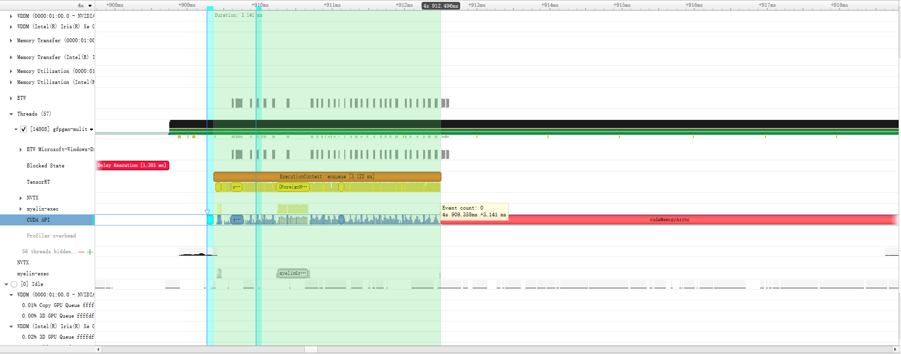
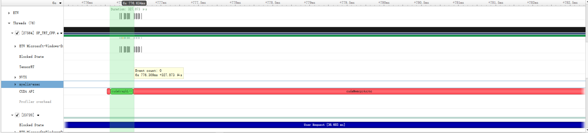

# 使用 TensorRT 部署 GFPGAN 详细流程

本文档仅记录可行的操作步骤。

# 软件和硬件环境

硬件环境:
1. CPU: 13th Gen Intel(R) Core(TM) i9-13905H
2. GPU: NVIDIA GeForce RTX 4070 Laptop GPU, 8.0GB
3. 内存: 64GB

软件环境:
1. OS: Windows 11, 22H2, 22621.3007
2. NVIDIA 控制面板 -> 系统信息 -> 显示 -> 驱动程序版本 -> 546.01
3. 系统环境变量 -> CUDA_PATH:C:\Program Files\NVIDIA GPU Computing Toolkit\CUDA\v12.2
4. 系统环境变量 -> CUDA_MODULE_LOADING:LAZY
5. 系统环境变量 -> Path:D:\TensorRT-8.6.1.6\lib
6. 系统环境变量 -> Path:C:\Program Files\NVIDIA GPU Computing Toolkit\CUDA\v12.2\bin
7. 系统环境变量 -> Path:C:\Program Files\NVIDIA GPU Computing Toolkit\CUDA\v12.2\libnvvp
8. cudnn version: C:\Program Files\NVIDIA GPU Computing Toolkit\CUDA\v12.2\include\cudnn_version.h

# 中间表示形式（IR）: ONNX

IR 中算子对开发语言做出限制。比如：已知Python中函数```fun()```返回值的默认类型是双精度浮点(Double\Float64)。已知ONNX中```Conv```算子要求```x```和```w```类型相同。
若在```forward()```接收的```w```是```Float32```的情况下，需要将```fun()```作为```w```输入，则可能存在以下问题：
1. 增加若干多余的```Cast```节点。
2. 直接提示```x```和```w```类型不同，抛出错误。  

综上，需要调整一些Python代码以获得预期的ONNX。

# GFPGAN 模型处理

模型项目仓库：[GFPGAN](https://github.com/TencentARC/GFPGAN)  
模型使用的权重文件，运行项目时自动下载。  
本文档部署的是 ***v1.2*** 版本，对应的主权重文件名称为： ***GFPGANCleanv1-NoCE-C2.pth***。  

|项目|值|
|---|---|
|输入名称(std::string)|input|
|输入数量|1|
|输入数据类型|uint8|
|输出名称(std::string)|input|
|输出数量|1|
|输出数据类型|uint8|

## 删除 ONNX 中多余的 Cast to Double节点
现象：A的输出结果，在作为B的输入参与运算时，需要先上转到Double。而B的输出在参与后续运算时却需要先下转为Float32。
排查：Double类型来源于代码：gfpgan/archs/stylegan2_clean_arch.py:Line 132：
```python
    def forward(self, x, style, noise=None):
        # ...
        # out type: torch.Tensor        
        if noise is None:
            b, _, h, w = out.shape
            noise = out.new_empty(b, 1, h, w).normal_()
        # ...
        return out
```
修改：
```python
if noise is None:
    b, _, h, w = out.shape
    # noise = out.new_empty(b, 1, h, w).normal_()
    noise = torch.randn(size=(b, 1, h, w), device=out.device)
```

依据：
原始代码的功能如下：[torch.Tensor.new_empty](https://pytorch.org/docs/stable/generated/torch.Tensor.new_empty.html#torch.Tensor.new_empty)，[TORCH.TENSOR.NORMAL_](https://pytorch.org/docs/stable/generated/torch.Tensor.normal_.html#torch.Tensor.normal_)。作用：
1. new_empty生成一个与输入Tensor属性相同的未初始化的Tensor。
2. NORMAL_()负责初始化。默认形参：mean=0, std=1。

综上，使用[torch.randn](https://pytorch.org/docs/stable/generated/torch.randn.html#torch-randn)可以平替。

## 删除多余的输出(叶子节点)

现象：直接导出的 ONNX 文件中包含多个输出节点。
排查：gfpgan/archs/gfpganv1_clean_arch.py:Line 315~324:
```python
# ...
if return_rgb:
    out_rgbs.append(self.toRGB[i](feat))
# ...
return  image, out_rgbs
```

修改：
```python
# ...
# if return_rgb:
#     out_rgbs.append(self.toRGB[i](feat))
# ...
# return  image, out_rgbs
return  image
```

依据：
这个地方的输出方便查看处理过程中的中间值，在实际使用时无意义，故此可以直接删除。

## (可选)Float16溢出
按照指定方法解决即可。注意某些层需要略过。

# ONNX 处理

有一些工具可以将合并 ONNX 中的算子，也许对推理有益，也许没有，比如：[onnx-simplifier](https://github.com/daquexian/onnx-simplifier)。但是推荐使用TensorRT完整的Toolchains。

***注意：*** TensorRT工具链中，Windows下基于Python的部分工具目前不能直接通过 ```pip``` 工具安装，其安装方式来源于：[TRT 工具安装方式](https://docs.nvidia.com/deeplearning/tensorrt/quick-start-guide/index.html#installing-pip)。

## 导出 ONNX
由于将归一化和反归一化融合到网络模型中完成，需要对原始的 GFPGAN 重新封装如下，包含导出代码：
```python
import torch
import torch.nn as nn
from gfpgan.archs.gfpganv1_clean_arch import GFPGANv1Clean

class ONNX_Model(nn.Module):
    def __init__(self):
        super(ONNX_Model, self).__init__()

        # self.device = torch.device('cuda')

        self.sf = GFPGANv1Clean(
                out_size=512,
                num_style_feat=512,
                channel_multiplier=2,
                decoder_load_path=None,
                fix_decoder=False,
                num_mlp=8,
                input_is_latent=True,
                different_w=True,
                narrow=1,
                sft_half=True)

        self.sf.eval()
        loadnet = torch.load('./gfpgan/weights/v12.pth')

        if 'params_ema' in loadnet:
            keyname = 'params_ema'
        else:
            keyname = 'params'
        self.sf.load_state_dict(loadnet[keyname], strict=False)
        self.sf.eval()

    def forward(self, x):
        # 归一化 begin
        x = x / 255.0
        x = (x - 0.5) / 0.5
        # 归一化 end

        x = self.sf(x)

        # 反归一化 begin
        x = (x + 1.0) / 2.0
        x = (x * 255.0).round()        
        x = torch.clip(x, min=0, max=255)
        x = torch.tensor(x, dtype=torch.uint8)
        # 反归一化 end
        return x

gfpgan = ONNX_Model()
gfpgan.eval()

torch.onnx.export( gfpgan,
                   torch.randint(low=0, high=255, size=(1, 3, 512, 512), dtype=torch.uint8),
                   "gfpgan.onnx",
                   verbose=True,
                   input_names=['input'],
                   output_names=['output'],
                   opset_version=13
)
```

## 合并常量 和 清理无用节点
文档参考：[官方常量合并示例](https://github.com/NVIDIA/TensorRT/tree/release/8.6/tools/onnx-graphsurgeon/examples/05_folding_constants)。
注意，这里一些操作需要依赖三方包，按需下载即可。

代码：tools/onnx-graphsurgeon/examples/05_folding_constants/fold.py:
```python
import onnx
import onnx_graphsurgeon as gs

model = onnx.load(r"D:\lqh12\GFPGAN-Clean\ce.onnx")

graph = gs.import_onnx(model)
graph.cleanup(remove_unused_graph_inputs=True, remove_unused_node_outputs=True)
graph.fold_constants().cleanup()

onnx.save(gs.export_onnx(graph), r"D:\lqh12\GFPGAN-Clean\ce-test-constant-flod.onnx")
print('done!')
```

效果：在处理前，ONNX 文件中包含多个 ```RandomNormalLike```类型的节点。经过处理后，ONNX 文件中的节点消失。

## 使用 TRT 提供的 fake_quant 进行INT8量化

注意，[ONNX Runtime](https://onnxruntime.ai/)量化工具链与TRT量化工具链处理过的ONNX文件并非完全通用。
本处使用的参考项目来源于[pytorch-quantization](https://github.com/NVIDIA/TensorRT/tree/release/8.6/tools/pytorch-quantization)。
[参考文档](https://docs.nvidia.com/deeplearning/tensorrt/pytorch-quantization-toolkit/docs/index.html)。

代码：
```python
import torch
import torch.nn as nn
from gfpgan.archs.gfpganv1_clean_arch import GFPGANv1Clean
from pytorch_quantization import tensor_quant, quant_modules
from pytorch_quantization import nn as quant_nn

quant_modules.initialize()
quant_nn.TensorQuantizer.use_fb_fake_quant = True

class ONNX_Model(nn.Module):
    def __init__(self):
        # ... init ...

    def forward(self, x):
        # ... forward ...

gfpgan = ONNX_Model()
gfpgan.eval()

torch.onnx.export( ... )

```

# 使用 TRT 推理
以下两种方式都可得到供TRT运行使用的计划文件：
- 安装TRT时，bin目录下trtexec.exe 可执行文件
- 基于API自行开发。

trtexec.exe文件使用灵活，API更倾向于调试高级应用。本文使用```trtexec.exe```，API使用方法见项目工程：sf_trt.h:GenerateEngineFromONNX()。

## 编译 ONNX 文件

命令如下：
```
trtexec.exe --onnx=main.onnx --saveEngine=main.trt --best
```

trtexec更多使用方法可以参考[这里](https://docs.nvidia.com/deeplearning/tensorrt/developer-guide/index.html#trtexec-ovr)。

使用API流程;
1. 加载 ONNX 文件。
2. 创建 Network。
3. 设置配置。
4. (可选)如果用INT8量化，则可设置标定接口，戳[这里](https://docs.nvidia.com/deeplearning/tensorrt/developer-guide/index.html#enable_int8_c)。
5. 序列化，保存二进制文件。因为是二进制文件，所以后缀无所谓。

## 使用 TRT 进行推理
在将归一化和反归一化都融合到神经网络模型后，推理过程如下：
1. 在 Host 端将相机数据变换为[R,G,B]格式。
2. Host 端发处H2D数据拷贝指令。异步拷贝，直接返回。
3. Host 端发出Inference指令。异步执行，直接返回。
4. Host 端发处D2H数据拷贝指令。异步拷贝，直接返回。
5. 等待 Stream 中指令完成。
6. Host 端获取到推理结果（[R,G,B]格式），合并为彩色图像。
7. 一帧的处理结束。

## 性能提升实践

硬件负责计算，CUDA告诉硬件‘算什么’，TRT负责翻译，顺便搞一下优化。因此，调优需要利用一些CUDA机制。TRT性能最佳实践点[这里](https://docs.nvidia.com/deeplearning/tensorrt/developer-guide/index.html#performance)。
此外，优化是在速度、精度和设备功耗之间选择平衡点。

### CUDA-GRAPHS 机制
使用文档[https://docs.nvidia.com/deeplearning/tensorrt/developer-guide/index.html#cuda-graphs](https://docs.nvidia.com/deeplearning/tensorrt/developer-guide/index.html#cuda-graphs)
流程如下：
1. 加载trt文件。
2. 执行一次推理，固定图结构。
3. 设置Stream进入快照模式。
4. 在相同Stream执行一次推理。
5. Stream结束快照。
6. 在相同Stream创建快照实例。
7. 释放无关资源。
8. 推理：在相同Stream上，Launch创建的快照实例。

```c++
bool GfpGanClass::pPrepareCudaGraphs()
{
	cudaStreamCreate(&p_cuda_stream_4_graphs);

	this->p_trt_infer_context->enqueueV3(p_cuda_stream_4_graphs);

	cudaStreamBeginCapture(p_cuda_stream_4_graphs, cudaStreamCaptureModeThreadLocal);

	p_trt_infer_context->enqueueV3(p_cuda_stream_4_graphs);

	cudaStreamEndCapture(p_cuda_stream_4_graphs, &p_cuda_graph);

	cudaGraphInstantiate(&p_cuda_instance, p_cuda_graph, 0);
    
	cudaGraphDestroy(p_cuda_graph);

	return true;
}

cv::Mat GfpGanClass::InferenceCudaGraphs(cv::Mat in_img)
{		
	CHECK(cudaMemcpyAsync(p_gpu_buffer_infer[p_gpu_buffer_input_index],
		this->p_cpu_infer_input_buffer,
		p_in_img_data_size,
		cudaMemcpyHostToDevice, p_cuda_stream_4_graphs));

	cudaGraphLaunch(p_cuda_instance, p_cuda_stream_4_graphs);

	CHECK(cudaMemcpyAsync(this->p_cpu_infer_output_buffer,
		p_gpu_buffer_infer[p_gpu_buffer_output_index],
		p_out_img_data_size, cudaMemcpyDeviceToHost, p_cuda_stream_4_graphs));

	cudaStreamSynchronize(p_cuda_stream_4_graphs);

	return this->p_infer_result;
}
```

文字版原理解释：[https://docs.nvidia.com/cuda/cuda-c-programming-guide/index.html?highlight=cudaStreamBeginCapture#creating-a-graph-using-stream-capture](https://docs.nvidia.com/cuda/cuda-c-programming-guide/index.html?highlight=cudaStreamBeginCapture#creating-a-graph-using-stream-capture)。
还有一个[Blog](https://developer.nvidia.com/blog/cuda-graphs/)。
在DX12、OCL等中有类似命令重放功能。

字太多不看系列，使用[NVIDIA Nsight Systems](https://developer.nvidia.com/nsight-systems)如下两图所示。NVIDIA Nsight Systems的简易使用手册来自[这里](https://docs.nvidia.com/deeplearning/tensorrt/developer-guide/index.html#nvprof)。

首先是不使用 CUDA-GRAPHS，使用 ```enqueueV3()```。<br>


绿色选中区域持续时间是2.141ms。CUDA API这一行，包含若干小事件，然后是一个```cudaMemcpuAsync```。

使用CUDA-GRAPHS，变成如下图所示的样子：<br>


绿色选中区域持续时间是327.873ųs。CUDA API这一行，包含一个```cudaGraphLanunch```事件，然后是一个```cudaMemcpuAsync```。

### Multi-Stream 模式

TRT文档给出的使用方法[https://docs.nvidia.com/deeplearning/tensorrt/developer-guide/index.html#within-inference-multi-streaming](https://docs.nvidia.com/deeplearning/tensorrt/developer-guide/index.html#within-inference-multi-streaming)。
CUDA文档对Streams的解释[here](https://docs.nvidia.com/cuda/cuda-c-programming-guide/index.html?highlight=cudaStreamBeginCapture#streams)。

流程如下：
1. 创建流
2. 使用流
3. 释放流

示例代码：
```c++
// 创建 CUDA_MULTI_STREAM_NB 个流，以便循环使用
GfpGanClass::GfpGanClass()
{
    p_multi_stream_index = 0;
	for (int i = 0; i < CUDA_MULTI_STREAM_NB; i++)
	{
		cudaStreamCreate(&p_cuda_streams[i]);
	}
}

// 循环使用流
cv::Mat GfpGanClass::Inference(cv::Mat in_img)
{		
	CHECK(cudaMemcpyAsync(p_gpu_buffer_infer[p_gpu_buffer_input_index],
		this->p_cpu_infer_input_buffer,
		p_in_img_data_size,
		cudaMemcpyHostToDevice, this->p_cuda_streams[p_multi_stream_index]));
	
	this->p_trt_infer_context->enqueueV3(this->p_cuda_streams[p_multi_stream_index]);
	
	CHECK(cudaMemcpyAsync(this->p_cpu_infer_output_buffer,
		p_gpu_buffer_infer[p_gpu_buffer_output_index],
		p_out_img_data_size, cudaMemcpyDeviceToHost, this->p_cuda_streams[p_multi_stream_index]));
	
	cudaStreamSynchronize(this->p_cuda_streams[p_multi_stream_index]);	
	
	p_multi_stream_index = (++p_multi_stream_index) % CUDA_MULTI_STREAM_NB;

	return this->p_infer_result;
}
```
***注意:***实际部署中并没有使用多流推理，原因[如下](https://docs.nvidia.com/deeplearning/tensorrt/developer-guide/index.html#within-inference-multi-streaming:~:text=Asynchronous%20commands%20put%20into%20a%20stream%20are%20guaranteed%20to%20run%20in%20sequence%20but%20may%20execute%20out%20of%20order%20with%20respect%20to%20other%20streams.)：其本身无法保证不同流之间的顺序性，在本文业务场景下，增加同步性机制得不偿失。换而言之，当前性能被相机IO限制，而不是推理速度。

# 实际测试效果

将推理融合到superface项目中，在设备接电的情况下，连续推理 200 帧，取平均值得到。各个阶段包含的操作如下：
1. pre-process: ```cv::split(input_img, this->p_split_result_vec);```  
2. inference: ```H2D + Inference + D2H + Sync```  
3. post-process:```cv::merge(this->p_merge_result_vec, this->p_infer_result);```  

测得实际结果如下：
|项目|值|
|---|---|
|推理模式|CUDA_GRAPHS|
|输入数据类型|uint8|
|输出数据类型|uint8|
|pre-process|0.05ms|
|inference|15.0ms|
|post-process|0.06ms|
|CUDA|44%|
|GPU memory(work)|1.1/8.0GB|
|GPU memory(not work)|0.6/8.0GB|
|GPU Totally|45%(Copy mainly)|

|项目|值|
|---|---|
|推理模式|enqueueV3|
|输入数据类型|uint8|
|输出数据类型|uint8|
|pre-process|0.05ms|
|inference|15.8ms|
|post-process|0.08ms|
|CUDA|46%|
|GPU memory(work)|1.1/8.0GB|
|GPU memory(not work)|0.6/8.0GB|
|GPU Totally|9%(Copy mainly)|