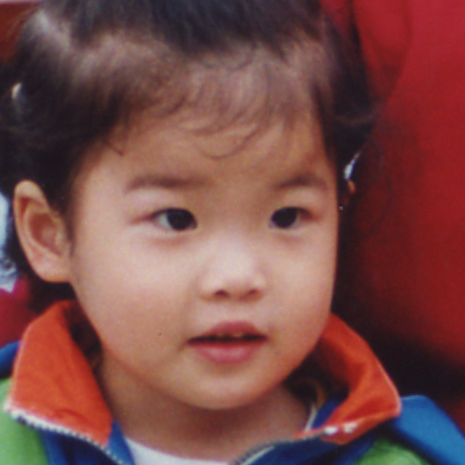
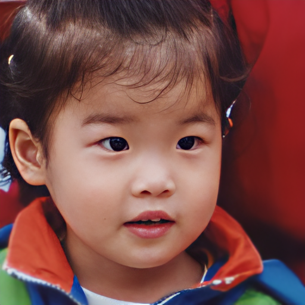
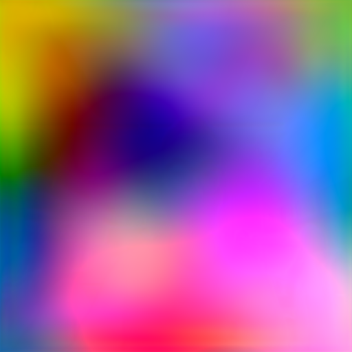
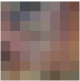
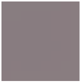
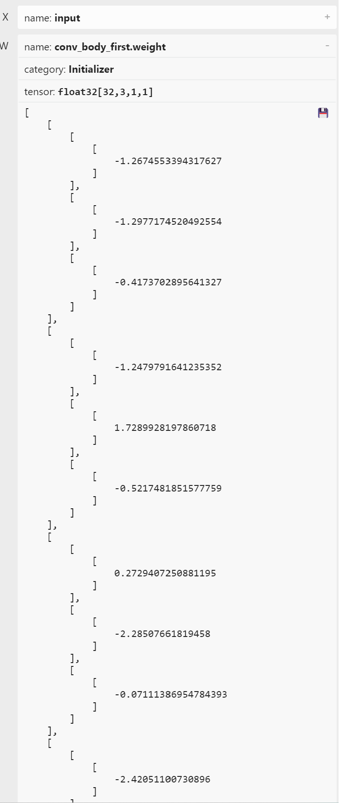
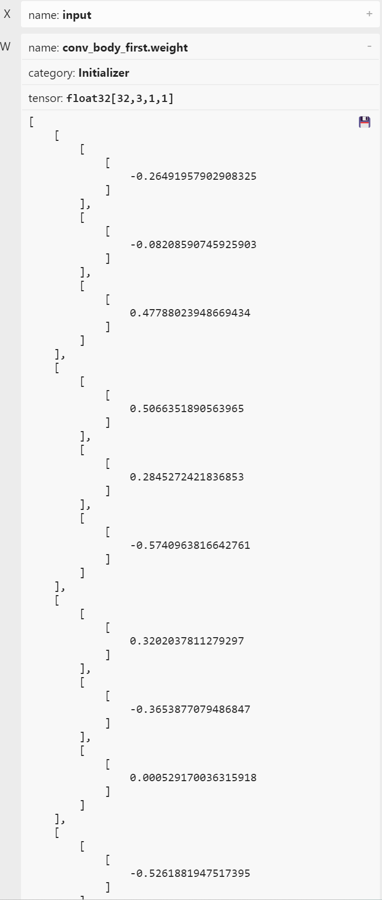

# 基于Libtorch的GFPGAN推理Debug
千辛万苦torch.jit.script(gfpgan)不报错，推理结果却匪夷所思：

原图如下：
<br>


预期如下：
<br>


实际如下：
<br>


# 现象

以相机作为数据源，实时输出推理结果，一直显示错误的图像。而且，错误图像并不随真实图像中内容变化有明显变化。

# 确定排查方向

以下信息是确定的：
1. 输入到模型中的待计算数据是相同的。
2. 获取到的模型推理结果是正确的。
3. 没有任何涉及到script导出相关的Warning。

现有怀疑点如下：
1. 导出错误。导出过程没有错误，只代表没有编译错误，不代表导出的pt文件可用。GFPGAN[仓库](https://github.com/TencentARC/GFPGAN/tree/master)中原始代码中有若干条件判断，从结构上讲有一定的复杂性。
2. pt文件推理过程中某个（些）节点计算错误。

# 初步排查
## 查找DeBug工具
原则上讲，script作为python的子集，应该也可以使用pdb类的工具。但是并不打算直接debug，工作量较大。

# 开始DeBug

## 观察阶段性的输出是否正确
思路：直接比较onnx的推理结果。使用[onnxruntime](https://onnxruntime.ai/)完成推理。GFPGAN仓库代码中，```out_rgbs.append(self.toRGB[i](feat))```返回这行代码的计算值即可。
```python
import onnxruntime as ort
import cv2
from torchvision.transforms.functional import normalize
from basicsr.utils import img2tensor, tensor2img
import torch

in_img = cv2.imread(r".\results\cropped_faces\00_00.png")
in_img = cv2.resize(in_img, (512, 512))
# 统一预处理方式
cropped_face_t = img2tensor(in_img / 255., bgr2rgb=True, float32=True)
normalize(cropped_face_t, (0.5, 0.5, 0.5), (0.5, 0.5, 0.5), inplace=True)
cropped_face_t = cropped_face_t.unsqueeze(0)

# 这个是原始的 onnx 文件，8个输出，1个输入
# onnx_path = r"D:\lqh12\GFPGAN\ce.onnx"
# 这个是经过修改后，可以成功script导出的模型
onnx_path = r"jit-ok.onnx"

session = ort.InferenceSession(onnx_path, providers=['CPUExecutionProvider'])
outputs = session.run(None, {"input": cropped_face_t.numpy()})

# 保存文件

```
出结果了，第一个节点的输出就有问题（由于第一个节点的输出size=(1,3, 8, 8)，放大2000%上传图片）。
预期如下：
<br>


实际如下：
<br>


***分析***：第一个输出只是经过了8个ResBlock的处理，为什么实际结果是这个样子的呢？果断观察onnx文件中，节点的权重，也离了个大谱：
预期如下：
<br>


实际如下：
<br>


***分析***：莫非是在load原始权重文件时出错了？在修改伊始，就已经注意防范出现这个问题，可是如果k-v无法对齐，一定会有提示的！

## 分析权重加载是否出错
***思路***：直接torch.jit.script之前，使用nn.module的gfpgan对象完成一次推理，查看结果: 依旧是错误结果，如上图[jit-ok.onnx 实际推理结果]。这个现象属于情理之中。
那么答案呼之欲出！只需要记住，完整的加载代码如下：
```python
gfpgan = GFPGANv1Clean(
                out_size=512,
                num_style_feat=512,
                channel_multiplier=2,
                decoder_load_path=None,
                fix_decoder=False,
                num_mlp=8,
                input_is_latent=True,
                different_w=True,
                narrow=1,
                sft_half=True)
loadnet = torch.load('../GFPGAN-CLEAN/gfpgan/weights/GFPGANCleanv1-NoCE-C2.pth')
if 'params_ema' in loadnet:
    keyname = 'params_ema'
else:
    keyname = 'params'
gfpgan.load_state_dict(loadnet[keyname], strict=False)
gfpgan.eval()
```
# 总结
是的，我没想错，压根就没加载权重文件！
